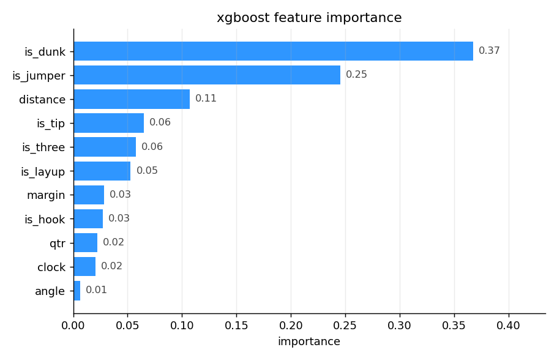
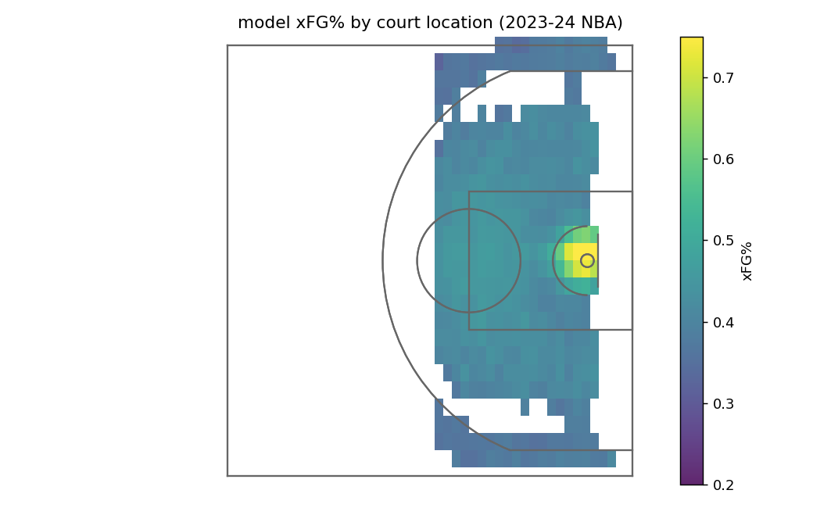
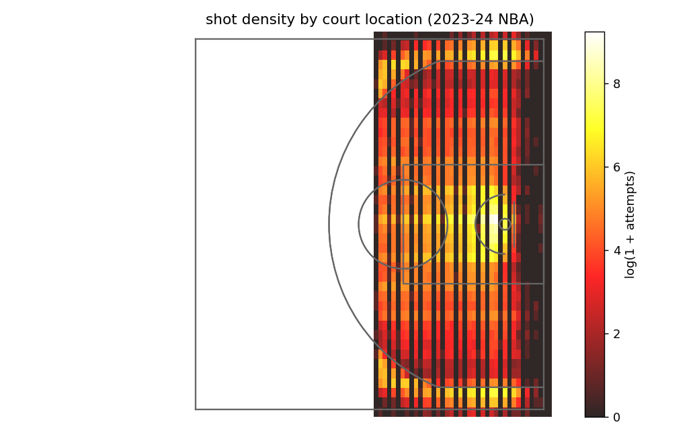
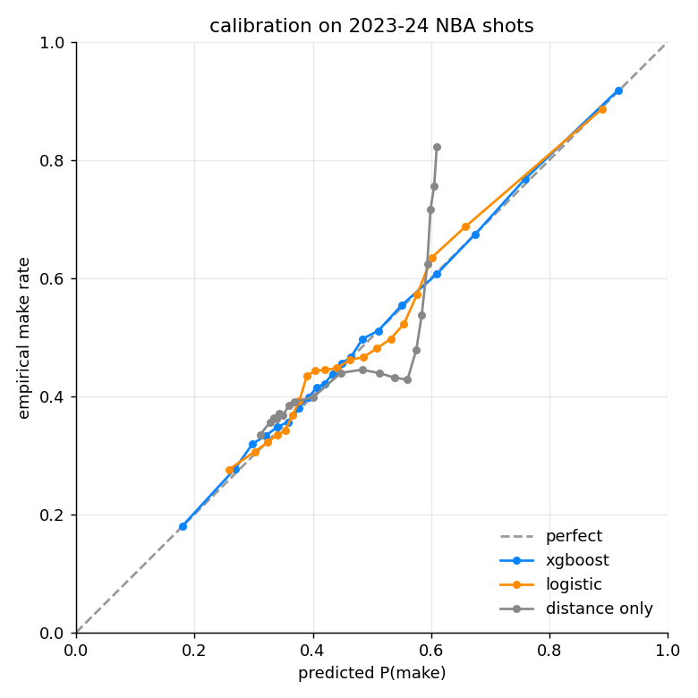

# hoopvision

A shot quality model for NBA field goal attempts. Given where on the floor a shot was taken, what type it was, and the game state, what's the probability it goes in? Three regular seasons of play-by-play (2021-22 through 2023-24), about 672k shots, hooked through duckdb / pandas and modeled with XGBoost.

Data is the public [hoopR-nba-data](https://github.com/sportsdataverse/hoopR-nba-data) mirror, which packages ESPN's play-by-play into one parquet per season.

## Headline numbers (held-out 2023-24 season, 225k shots)

| model                | log loss | brier  | auc    |
|----------------------|----------|--------|--------|
| league fg%           | 0.6909   | 0.2489 | 0.500  |
| distance-only logit  | 0.6677   | 0.2374 | 0.633  |
| logistic (all feats) | 0.6485   | 0.2290 | 0.651  |
| **xgboost**          | **0.6273** | **0.2200** | **0.683** |

For a shot quality model with no shooter ID, no defender position, and no rim-protection context, AUC 0.68 is what you'd expect. The Statcast/NBA Advanced Stats published xQ models add lineup and defender data and live around 0.72. Adding shooter as a fixed effect would close most of that gap.

## A note on data leakage

The very first version of this model hit AUC 0.89, which was suspicious. The bug: I'd built `is_three` from `score_value == 3` instead of from court geometry. `score_value` is zero for any miss, so my model was effectively reading the outcome from the inputs on 3-pointers. The fixed version derives `is_three` from distance and corner location, and the AUC drops to a realistic 0.68. I left the regression test in `tests/test_no_score_value_leak` so it can't sneak back in.

## What predicts a make?



The shot-type buckets (dunk, jumper, layup) dominate everything else. That's mostly because they encode "is this a rim attempt or not" cleanly. Distance picks up the next slice, followed by the corner-vs-above-the-break signal that `is_three` represents. Game-state features (clock, quarter, margin) barely move the needle.

## Where shots go in



The expected pattern: bright yellow at the rim, an iron-colored ring through the mid-range and three-point arc, and a slight bump in the corners (corner threes go in at about 38-39%, above-the-break threes at 36%). The model is averaging real shots in each bin, so empty patches mean the bin just didn't have enough attempts.

## And where they come from



The NBA in one heatmap: shots happen at the rim, around the arc, and almost nowhere in between. The mid-range is dead.

## Calibration



XGBoost hugs the diagonal across the full range. The distance-only logit predicts almost everything between 0.40 and 0.55, which is fine on average but useless if you want to say something specific about any one shot.

## Team-level shot-making

The leaderboard chart at `charts/shotmaking_top.png` and `_bot.png` ranks teams by how much their actual FG% beat their xFG%. The team_id column isn't joined to team names (yet), but the gap between top and bottom is about 4-5 points of FG% across a full season, which is roughly the spread you'd expect between an elite shotmaking team and a poor one once you've controlled for shot location and type.

## How it works

Each row in the modeling table is one field-goal attempt. Features:

- `distance` (feet from the offensive hoop)
- `angle` (degrees, 0 = straight on, 90 = corner)
- `is_three` (derived from distance + court location, never from score_value)
- `shot_type` (one-hot: dunk / hook / jumper / layup / tip)
- `margin` (score differential from shooting team's POV)
- `clock` (seconds remaining in the game)
- `qtr` (1-4 + OT)

Target is whether the shot went in. Train on 2021-22 and 2022-23, test on 2023-24. No game from a test season ever leaks into training.

The court is mirrored so the offense is always shooting at the hoop at `x_offense = 41.75`. ESPN's raw coords have the offense shooting at whichever hoop, and shooting twice at the same hoop in alternate halves, so the mirror keeps the geometry consistent.

## Reproducing

```
pip install -r requirements.txt
make all     # pulls ~80 MB of parquet, trains, charts in a couple of minutes
make test
```

## Layout

```
scripts/fetch.py          pull pbp parquet per season
scripts/build_dataset.py  filter to FG attempts + compute court features
scripts/train.py          train baselines + xgboost, save metrics + calibration
scripts/charts.py         render court, importance, calibration charts
tests/test_smoke.py       smoke + the no-leak regression test
```

## Caveats

The big one is no shooter and no defender. With shooter as a fixed effect (basically per-player FG% over expected) you'd pick up another 0.03-0.04 of AUC. With defender distance (which Second Spectrum publishes but ESPN's free feed doesn't) you'd be closing in on the published xQ benchmarks. Adding shot clock (separate from game clock) and play type (catch-and-shoot vs off-the-dribble) would help too.
